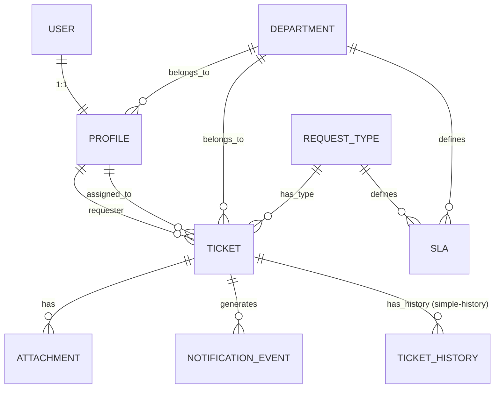

**PROMPT PARA DESARROLLAR LA APP TICKETS (HELPDESK) – MALL PLAZA**

Eres un Senior Django Developer. Debes implementar **completamente** la aplicación **tickets** (helpdesk interno de Mall Plaza San Miguel) siguiendo exactamente estas especificaciones.

**1. Contexto del proyecto**
- Nombre interno: `tickets` (o `helpdesk`)
- Propósito: Sistema de gestión de incidencias y solicitudes de servicio para el mall. Soporta tanto **incidents** como **service requests**.
- Tiempo de entrega del MVP: máximo **2 semanas** (15 de abril 2026).
- Todo el desarrollo es **100% Django puro** (Server-Side Rendering + HTMX + Tailwind). **No usar DRF** en esta fase.

**2. Tech stack obligatorio**
- Django 5.x
- django-fsm (para máquina de estados del Ticket)
- django-simple-history (audit trail completo)
- APScheduler (BackgroundScheduler) para el job de envío de emails
- HTMX + Tailwind para la UI
- AWS: S3 (attachments), SES (emails), ECS Fargate (deploy), CloudWatch
- Base de datos: PostgreSQL (RDS)

**3. Autenticación y Roles**
- Ya existe un módulo de **login con OTP por correo** (50% terminado). Úsalo.
- **Siempre debe existir** un `django.contrib.auth.User` + `Profile` antes de permitir crear un Ticket.
- Después de verificar OTP:
  - Si el User no existe → crearlo automáticamente (`is_active=True`, `is_staff=False`).
  - Crear automáticamente el `Profile` asociado.
- Roles (usar `models.IntegerChoices`):

```python
class Role(models.IntegerChoices):
    REQUESTER = 1, "Requester"
    TECHNICIAN = 2, "Technician"
    SUPERVISOR = 3, "Supervisor"
    ADMINISTRATOR = 4, "Administrator"
```

**4. Modelo de dominio completo (debes implementar exactamente así)**

Crea la app Django `tickets` y genera los siguientes modelos:

- **Profile** (OneToOne con User)
- **Department** (área/especialidad: “Pantallas”, “Redes”, “Hardware”, etc.)
- **RequestType** (antes llamado TicketType) – tipo de requerimiento
- **SLA** (definido por combinación RequestType + Department)
- **Ticket** (núcleo del sistema)
- **Attachment** (archivos en S3)
- **NotificationEvent** (para el job APScheduler)

Incluye todas las relaciones, campos, choices, métodos y constraints que se detallan en el diagrama ER siguiente (usa este ER como referencia exacta):



**Campos y lógica exacta de cada modelo (copia esto literalmente):**

- **Profile**: role (IntegerChoices), department (FK), phone (opcional)
- **Department**: name (PK), description
- **RequestType**: name (PK), category (choices: 'incident' | 'service_request'), description, default_priority
- **SLA**: request_type (FK), department (FK), response_time_hours, resolution_time_hours, valid_from, valid_to (null = vigente). Unique together (request_type, department, valid_from)
- **Ticket**:
  - number (auto, formato TICKET-YYYYMMDD-XXX)
  - request_type (FK)
  - requester (FK Profile)
  - assigned_to (FK Profile, solo TECHNICIAN)
  - base_status (FSMField: 'open', 'in_progress', 'closed')
  - trait (choices según estado: unassigned/assigned, working/stopped, solved/not_proceeds/cancelled)
  - description
  - due_date (calculado automáticamente al asignar usando SLA)
  - department (FK)
  - history = HistoricalRecords()
- **Attachment**: ticket (FK), file_name, s3_key
- **NotificationEvent**: ticket, event_type, recipient_email, body_html, status (pending/sent/failed), attempts, etc.

**5. Máquina de estados (django-fsm)**
- Transiciones principales:
  - `start_progress(technician_profile)` → de open a in_progress + asigna SLA + calcula due_date
  - `toggle_stopped()` → alterna working/stopped
  - `close_ticket(reason)` → a closed con trait solved / not_proceeds / cancelled
- Usar signals `post_transition` para crear automáticamente NotificationEvent.

**6. Job de notificaciones**
- APScheduler BackgroundScheduler en `tickets/apps.py` (ready method)
- Job `send_pending_emails` que corre cada 30-60 segundos
- Envía emails vía SES usando templates Jinja (nuevo ticket, asignación, cambio de estado, SLA breach)

**7. Requerimientos de UI (HTMX)**
- Formulario público de creación de ticket (solo accesible después de login OTP)
- Dashboard por rol (requester ve sus tickets, technician ve asignados, supervisor ve todo)
- Timeline del historial (simple-history)
- Botones para cambiar estado (HTMX partials)

**8. Buenas prácticas obligatorias**
- Signals para creación automática de User + Profile después de OTP
- django-simple-history activado en Ticket y SLA
- Presigned URLs para attachments en S3
- Validaciones estrictas de roles en views y forms
- Tests básicos incluidos
- Preparado para deploy en ECS Fargate (blue-green)
